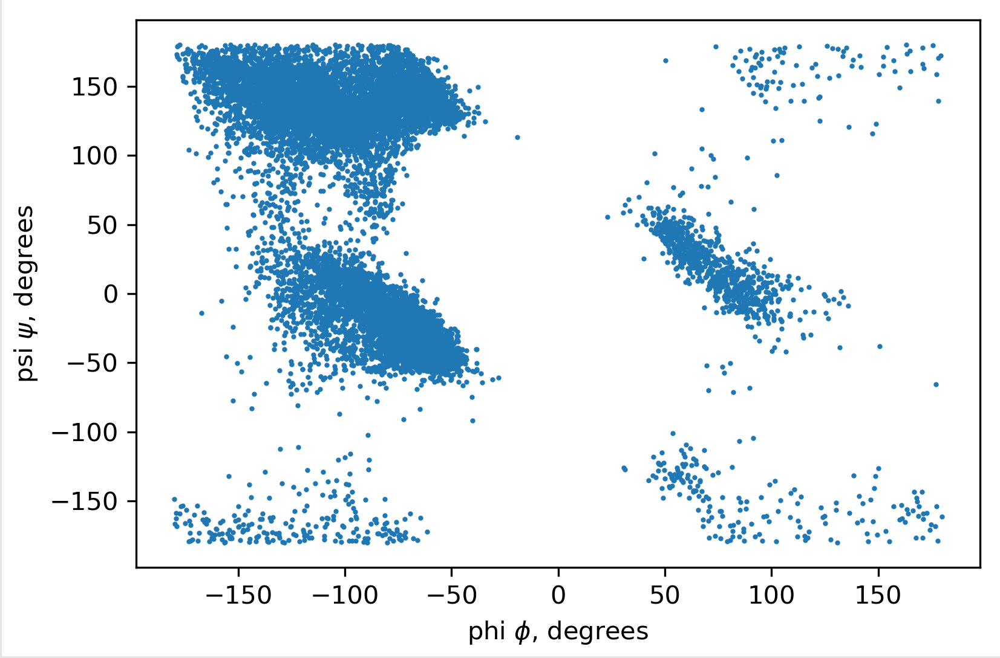

# Visualization of Top8000 Protein Dataset

The above files are for the ASBMB conference Teaching Science with Big Data workshop titled **Visualization of Top 8000’s Protein Dataset**. These materials are released under the [CC BY-NC-SA 4.0](https://creativecommons.org/licenses/by-nc-sa/4.0/).

## [View Completed Activity as Jupyter Book](https://weisscharlesj.github.io/BiopythonRamachandran/)

The goal of this activity is to provide the participant with experience using Python and Jupyter notebooks to process and visualize large amounts of protein structural data. This activity is broken down into three notebooks with the specific goals provided below.
1. Familiarize participants with Python, Jupyter, plotting data, and using Python functions
2. Extract information from PDB files and visualize it using Python and matplotlib
3. Examine bond angle data from multiple proteins and visualize it including generating Ramachandran plots and examing how secondary structure affects dihedral angles

This activity only uses a small subset from the Top8000 dataset, included below, due to time restriction. The full dataset has since become unavailable and is replaced by the top2018 dataset. This activity can be used with any collection of quality protein PDB files and does not inherantly require the above datasets.

[Download All Files as Zip](VisTop8000.zip)

[Download Completed Jupyter Notebooks](VisTop8000_COMPLETE.zip)

For resources on learning to program in Python for chemists and working with Biopython, see the free book [Scientific Computing for Chemists with Python](https://weisscharlesj.github.io/SciCompforChemists/notebooks/introduction/intro.html) including chapter 16 on bioinformatics.